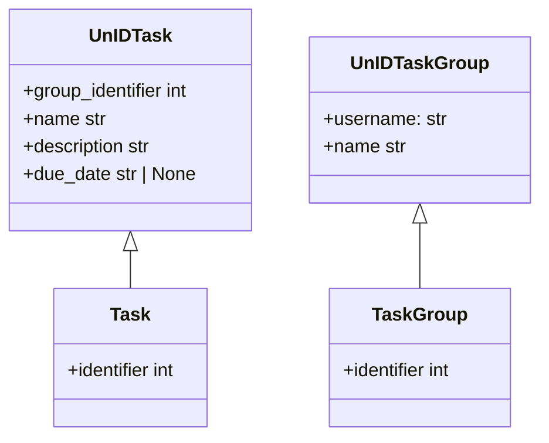
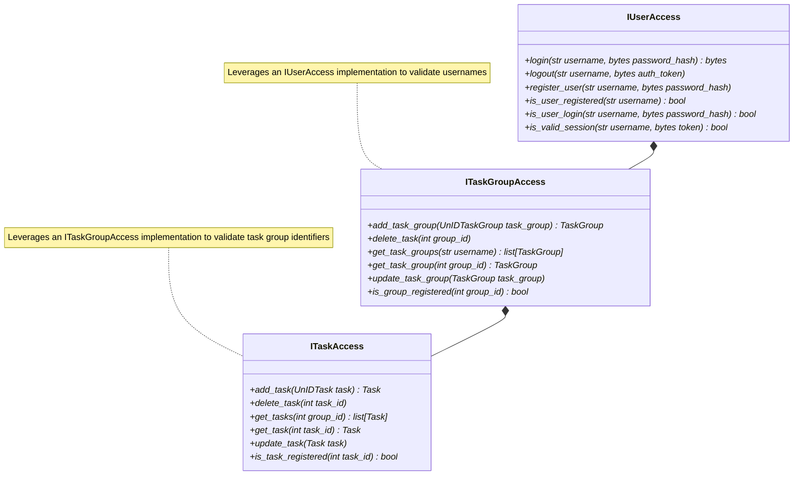
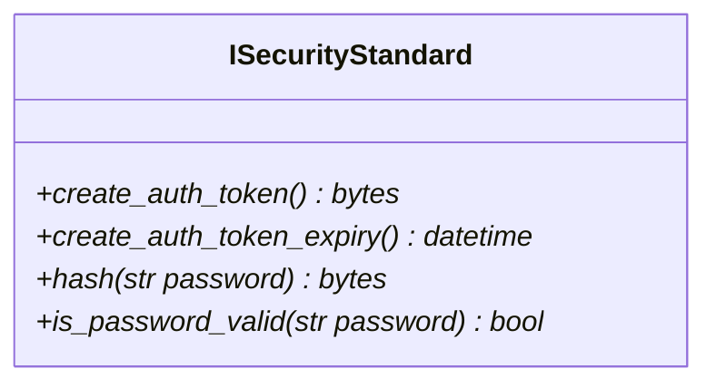
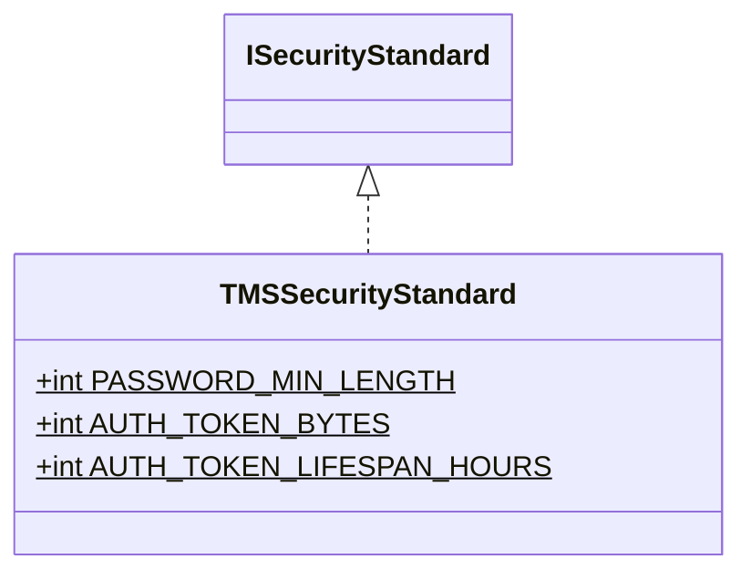
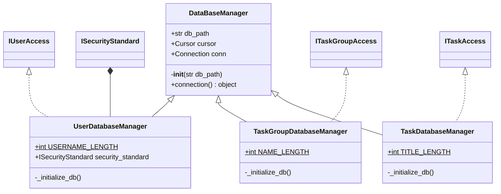
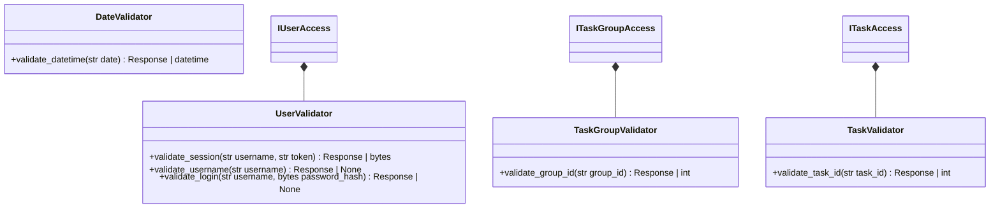
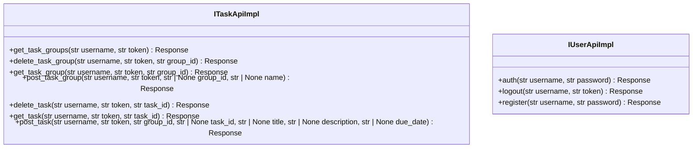
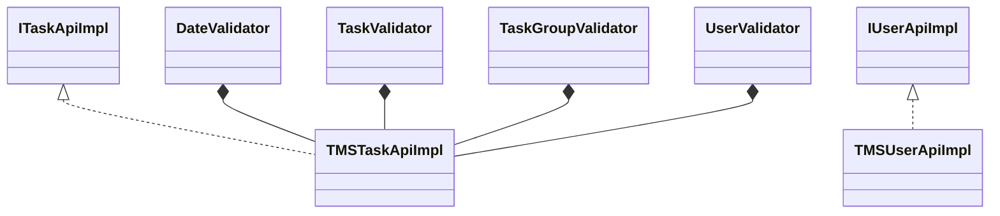
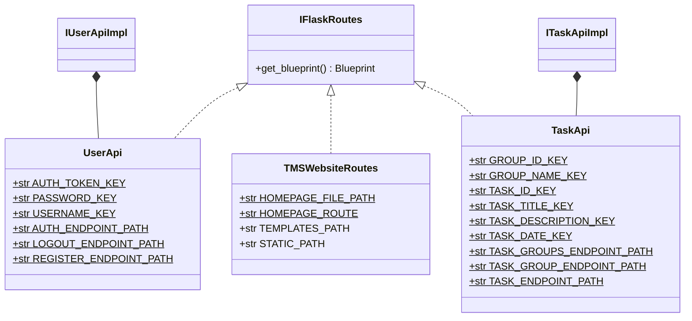

# Data holders

# Data access interfaces

# Security standard interface

# TMS security standard

# SQLite Database implementations

# Request data validators

# API route interfaces

# API route implementation

# Flask route providers

