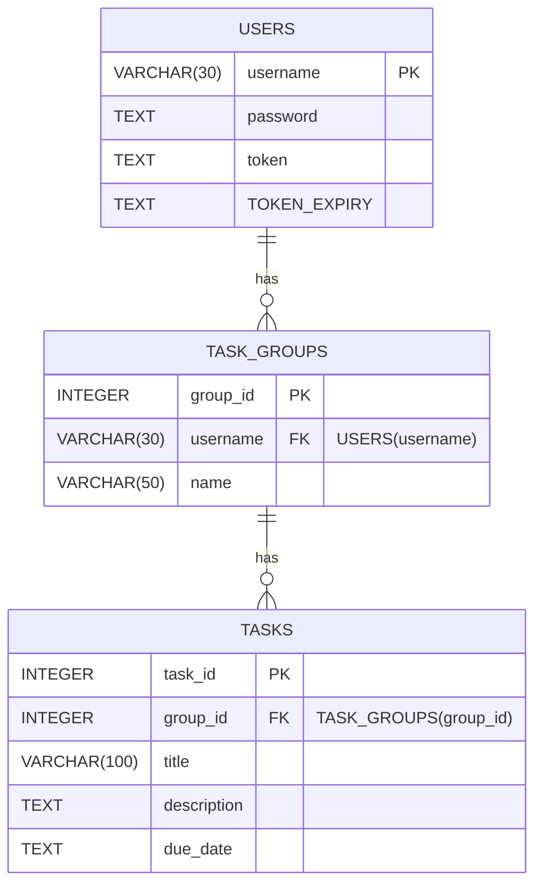

# Database Structure

## Legend

- **"PK"** indicated a primary key
- **"FK"** indicate a foreign key
- **"NN"** indicates not null value
- **"ISO8601"** Must follow IS0 standard 8601

## Tables

### USERS

- **username** - VARCHAR(30) - PK
- **password** - TEXT - NN
- **token** - TEXT
- **token_expiry** - TEXT ISO8601

### TASK_GROUPS

- **group_id** - INTEGER - PK
- **username** - FK for USERS - NN
- **name** - VARCHAR(50) NN

### TASKS

- **task_id** - INTEGER - PK
- **group_id** - FK for TASK_GROUPS - NN
- **title** - VARCHAR(100) NN
- **description** - TEXT NN
- **due_date** - TEXT ISO8601

## ER Diagram

