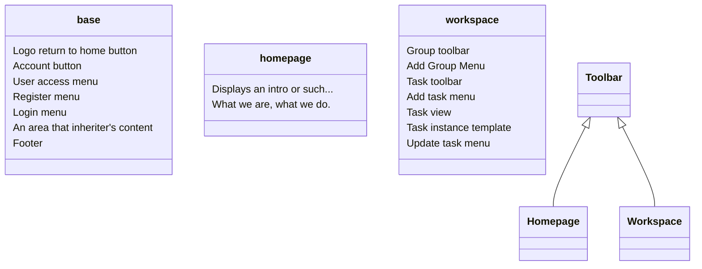

```mermaid
classDiagram
    class base{ 
        Logo return to home button
        Account button
        User access menu
        Register menu
        Login menu
        An area that inheriter's content
        Footer
    }
    class homepage{
        Displays an intro or such...
        What we are, what we do.
    }
    
    class workspace{
        Group toolbar
        Add Group Menu
        Task toolbar
        Add task menu
        Task view
        Task instance template
        Update task menu
    }
    Toolbar <|-- Homepage
    Toolbar <|-- Workspace
```